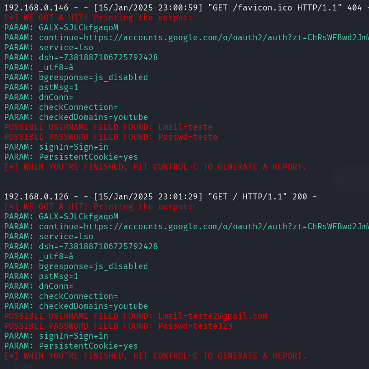

# Setoolkit Phishing Example

Exemplo de phishing utilizando o setoolkit para o Bootcamp de Cibersegurança do Santander 2024.

## Observações:
 - Utilizar VM com rede em modo Bridge.
 - Clonar a página de login.

## Ferramentas

- Kali Linux
- setoolkit

## Configurando o Phishing no Kali Linux

- Acesso root: ``` sudo su ```
- Iniciando o setoolkit: ``` setoolkit ```
- Tipo de ataque: ``` Social-Engineering Attacks ```
- Vetor de ataque: ``` Web Site Attack Vectors ```
- Método de ataque: ```Credential Harvester Attack Method ```
- Método de ataque: ``` Site Cloner ```
- Obtendo o endereço da máquina: ``` ifconfig ``` ou ``` ip address ``` 
- URL para clone: ``` http://www.google.com ```

## Resutados


